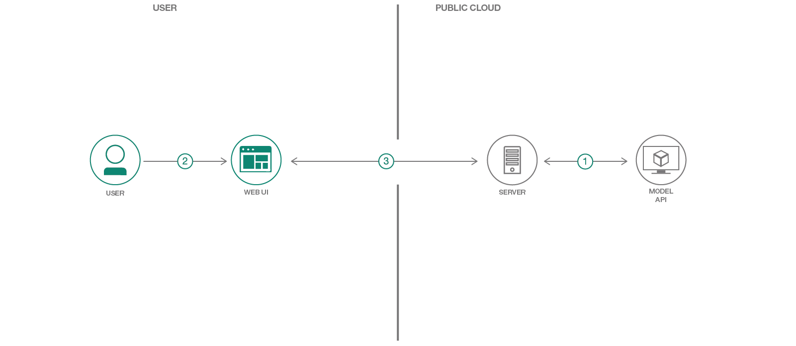

[](https://travis-ci.org/IBM/MAX-Image-Caption-Generator-Web-App)

# Create a web app to show the age estimation from the detected human faces

The biological ages of people oftentimes provide a significant information for many applications; for example, surveillance, product recommendation, etc. 
Existing commercial devices such as mobile phones, webcams are used to create visual data (images/videos) constantly. Given visual data with human faces,
the facial age estimator model predicts the ages of the detected faces. With the predicted ages, the information can be applied to different algorithms such as ``grouping'' which provides the observations in statistics --- different 
groups of people for various activities.       


In this Code Pattern we will use one of the models from the
[Model Asset Exchange (MAX)](https://developer.ibm.com/code/exchanges/models/),
an exchange where developers can find and experiment with open source deep learning
models. Specifically we will be using the [Facial Age Estimator](https://github.com/IBM/MAX-Facial-Age-Estimator)
to create a web application that will first detect human faces and then output the ages with the bounding boxes of the associated detected
faces. 
The web application provides an user-friendly interface
backed by a lightweight python server. The server takes webcam as input via the
UI and sends them to a REST end point for the model. The model's REST endpoint is set up using the docker image
provided on MAX. The Web UI displays the estimated age with the associated bounding box for each person.

When the reader has completed this Code Pattern, they will understand how to:

* Build a Docker image of the Facial Age Estimator MAX Model
* Deploy a deep learning model with a REST endpoint
* Generate the estimated ages for an image using the MAX Model's REST API
* Run a web application that using the model's REST API



## Flow

1. Server sends the captured video frame-by-frame from webcam to Model API.
2. Web UI requests the age and bounding box data for frame(s) from Server.
3. Server receives data from Model API and updates the result to Web UI.


## Included Components

* [IBM Model Asset Exchange](https://developer.ibm.com/code/exchanges/models/): A place for developers to find and use
free and open source deep learning models.
* [Docker](https://www.docker.com): Docker is a tool designed to make it easier to create, deploy, and run applications
by using containers.

## Featured Technologies

* [Python](https://www.python.org/): Python is a programming language that lets you work more quickly and integrate
your systems more effectively.
* [JQuery](https://jquery.com): jQuery is a cross-platform JavaScript library designed to simplify the client-side
scripting of HTML.
* [Bootstrap 3](https://getbootstrap.com): Bootstrap is a free and open-source front-end library for designing websites
and web applications.
* [Pexels](https://www.pexels.com): Pexels provides high quality and completely free stock photos licensed under the
Creative Commons Zero (CC0) license.

# Steps

Ways to run the code pattern:

- [Deploy to IBM Cloud](#deploy-to-ibm-cloud)
- [Deploy on Kubernetes](#deploy-on-kubernetes)
- [Run Locally](#run-locally)

## Deploy to IBM Cloud

### Deploy the Model

Follow the [Deploy the Model Doc](DEPLOY_MODEL.md) to deploy the Facial Age Estimator model to IBM Cloud.
If you already have a model API endpoint available you can skip this process.

> Note: Deploying the model can take time, to get going faster you can try [running locally](#run-locally).

### Deploy the Web App

1. Press the `Deploy to IBM Cloud` button. If you do not have an IBM Cloud account yet, you will need to create one.

    [](https://bluemix.net/deploy?repository=https://github.com/IBM/MAX-Age-Estimation-Web-App)

2. Click `Delivery Pipeline` and click the `Create +` button in the form to generate a `IBM Cloud API Key` for the web app.


3. Once the API key is generated, the `Region`, `Organization`, and `Space` form sections will populate. Fill in the
`Facial Age Estimator Model API Endpoint` section with the endpoint deployed above, then click on `Create`.

    > The format for this entry should be `http://170.0.0.1:5000`

4. In Toolchains, click on `Delivery Pipeline` to watch while the app is deployed. Once deployed, the app can be
viewed by clicking `View app`.

## Deploy on Kubernetes

You can also deploy the model and web app on Kubernetes using the latest docker images on Docker Hub.

On your Kubernetes cluster, run the following commands:

    kubectl apply -f https://raw.githubusercontent.com/IBM/MAX-Facial-Age-Estimator/master/max-facial-age-estimator.yaml
    kubectl apply -f https://raw.githubusercontent.com/IBM/MAX-Age-Estimation-Web-App/master/max-age-estimation-web-app.yaml

The web app will be available at port `7000` of your cluster.
The model will only be available internally, but can be accessed externally through the `NodePort`.

> Note: For deploying the web app on IBM Cloud it is recommended to follow the
[Deploy to IBM Cloud](#deploy-to-ibm-cloud) instructions above rather than deploying with IBM Cloud Kubernetes Service.

## Run Locally

> NOTE: These steps are only needed when running locally instead of using the `Deploy to IBM Cloud` button.

#### Setting up the MAX Model

1. [Deploy the Model](#1-deploy-the-model)
2. [Experimenting with the API (Optional)](#2-experimenting-with-the-api-optional)

#### Starting the Web App

1. [Check out the code](#1-check-out-the-code)
2. [Installing dependencies](#2-installing-dependencies)
3. [Running the server](#3-running-the-server)
4. [Instructions for Docker (Optional)](#4-instructions-for-docker-optional)

### Setting up the MAX Model

> NOTE: The set of instructions in this section are a modified version of the one found on the
[Facial Age Estimator Project Page](https://github.com/IBM/MAX-Facial-Age-Estimator)

#### 1. Deploy the Model

To run the docker image, which automatically starts the model serving API, run:

    docker run -it -p 5000:5000 codait/max-facial-age-estimator

This will pull a pre-built image from Docker Hub (or use an existing image if already cached locally) and run it.
If you'd rather build the model locally you can follow the steps in the
[model README](https://github.com/IBM/MAX-Facial-Age-Estimator/blob/master/README.md#steps).

_Note_ that currently this docker image is CPU only (we will add support for GPU images later).

#### 2. Experimenting with the API (Optional)

The API server automatically generates an interactive Swagger documentation page.
Go to `http://localhost:5000` to load it. From there you see the API with the test requests.

Use the `model/predict` endpoint to load a test file and get estimated ages and bounding boxes for the image from the API.

The [model assets folder](https://github.com/IBM/MAX-Facial-Age-Estimator/tree/master/assets)
contains one image you can use to test out the API, or you can use your own.

You can also test it on the command line, for example:

    curl -F "image=@path/to/tom_cruise.jpg" -X POST http://localhost:5000/model/predict

```json
{
  "status": "Okay",
  "predictions": [
    {
      "age_estimation": [
        48
      ],
      "face_box": [
        "303",
        "174",
        "379",
        "515"
      ]
    }
  ]
}
```

### Starting the Web App

#### 1. Check out the code

Clone the Age Estimation Web App repository locally by running the following command:

    git clone https://github.com/IBM/MAX-Age-Estimation-Web-App.git

> Note: You may need to `cd ..` out of the MAX-Age-Estimation directory first

Then change directory into the local repository

    cd MAX-Age-Estimation-Web-App

#### 2. Installing dependencies

Before running this web app you must install its dependencies:

    pip install -r requirements.txt

#### 3. Running the server

You then start the web app by running:

    python app.py

Once it's finished processing the default images (< 1 minute) you can then access the web app at:
[`http://localhost:7000`](http://localhost:7000)

The Facial Age Estimator endpoint must be available at `http://localhost:5000` for the web app to successfully start.

#### 4. Instructions for Docker (Optional)

To run the web app with Docker the containers running the web server and the REST endpoint need to share the same
network stack. This is done in the following steps:

Modify the command that runs the Facial Age Estimator REST endpoint to map an additional port in the container to a
port on the host machine. In the example below it is mapped to port `7000` on the host but other ports can also be used.

    docker run -it -p 5000:5000 -p 7000:7000 --name max-facial-age-estimator codait/max-age-estimation

<!--   
This part isn't sure yet!!!
docker run -it -p 5000:5000 -p 7000:7000 --name max-facial-age-estimator codait/max-facial-age-estimator
-->

Build the web app image by running:

    docker build -t max-age-estimator-web-app .

Run the web app container using:

    docker run --net='container:max-facial-age-estimator' -it max-age-estimation-web-app

<!--   
This part isn't sure yet!!!
docker run --net='container:max-facial-age-estimator' -it max-age-estimation-web-app
--->

##### Using the Docker Hub Image

You can also deploy the web app with the latest docker image available on DockerHub by running:

    docker run --net='container:max-facial-age-estimator' -it codait/max-age-estimation-web-app

This will use the model docker container run above and can be run without cloning the web app repo locally.

<!---
# Sample Output

--->

# Links

* [Model Asset eXchange (MAX)](https://developer.ibm.com/code/exchanges/models/)
* [Center for Open-Source Data & AI Technologies (CODAIT)](https://developer.ibm.com/code/open/centers/codait/)
* [MAX Announcement Blog](https://developer.ibm.com/code/2018/03/20/igniting-a-community-around-deep-learning-models-with-model-asset-exchange-max/)

## Libraries used in this Code Pattern
* [D3.js](https://d3js.org): D3.js is a JavaScript library for manipulating documents based on data.
* [d3-cloud](https://github.com/jasondavies/d3-cloud): A Wordle-inspired word cloud layout written in JavaScript.
* [Featherlight](https://noelboss.github.io/featherlight/): Featherlight is a very lightweight jQuery lightbox plugin.
* [Glyphicons](http://glyphicons.com): GLYPHICONS is a library of precisely prepared monochromatic icons and symbols,
created with an emphasis to simplicity and easy orientation.
* [Image Picker](http://rvera.github.io/image-picker/): Image Picker is a simple jQuery plugin that transforms a select
element into a more user friendly graphical interface.

# Learn More

* **Artificial Intelligence Code Patterns**: Enjoyed this Code Pattern? Check out our other
[Artificial Intelligence Code Patterns](https://developer.ibm.com/code/technologies/artificial-intelligence/)
* **AI and Data Code Pattern Playlist**: Bookmark our
[playlist](https://www.youtube.com/playlist?list=PLzUbsvIyrNfknNewObx5N7uGZ5FKH0Fde) with all of our Code Pattern videos
* **Watson Studio**: Master the art of data science with IBM's [Watson Studio](https://dataplatform.ibm.com/)
* **Deep Learning with Watson Studio**: Design and deploy deep learning models using neural networks, easily scale to
hundreds of training runs. Learn more at [Deep Learning with Watson Studio](https://www.ibm.com/cloud/deep-learning).

# License
[Apache 2.0](LICENSE)
